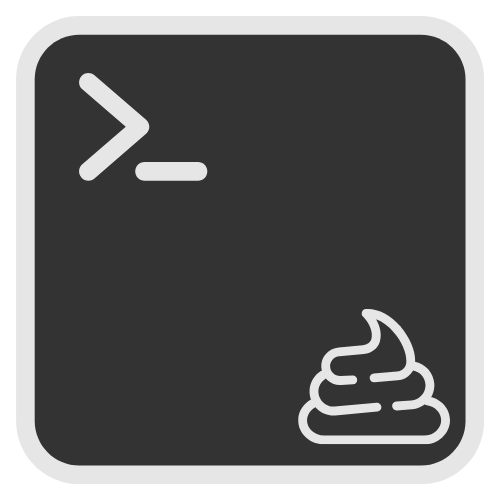

<div style="text-align: center;">
    
</div>

# 💩 shitty – Terminal Emulator
A playful, browser-based terminal emulator.

---

## ⚠️Status
This is just a toy project — **not production-ready**.  
Expect bugs, missing features, and the occasional *shitty* behavior.
---

## ✨Features
- Basic terminal UI
- Built-in commands:
    - `hello`
    - `clear`
    - `date`
    - `commands` (lists available commands)

---

## 🎯Goals
- Add more commands
- Integrate a file manager
- Store command history in a database
- Improve realism of terminal behavior

---

## 🚀How to Run
1. Clone the repo:
   ```bash
   git clone https://github.com/yourusername/shitty.git
